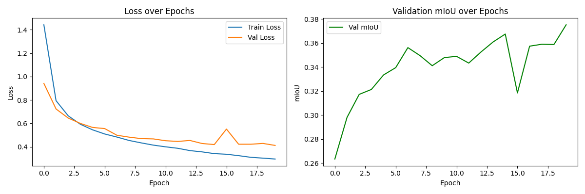
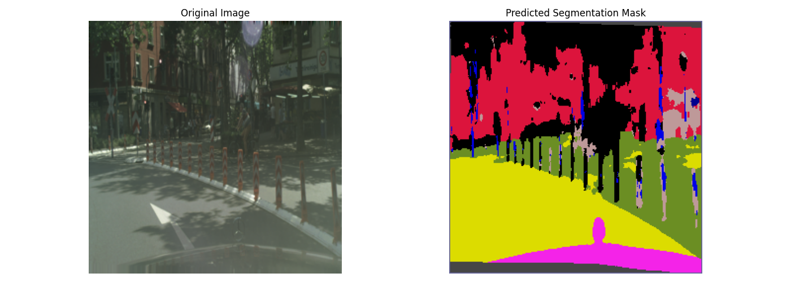

# U-Net Semantic Segmentation — Cityscapes

A semantic segmentation model built from scratch using PyTorch and U-Net architecture, trained on the Cityscapes urban driving dataset.

## Project Overview

This project trains a U-Net model to perform pixel-level classification on urban street scene images. For every pixel in a driving image, the model predicts one of 34 semantic classes including road, sky, buildings, vehicles, pedestrians, and vegetation.

## Results

| Metric | Value |
|---|---|
| Final Val Loss | 0.4117 |
| Final Val mIoU | 37.52% |
| Epochs Trained | 20 |
| Dataset | Cityscapes (2975 train / 500 val) |

### Training Curves

### Prediction Example

## Architecture — U-Net

U-Net consists of three parts:

- **Encoder** — progressively shrinks the image using convolutions and max pooling, extracting features at each scale
- **Bottleneck** — the most compressed representation of the image
- **Decoder** — expands back to original resolution using transposed convolutions, combined with encoder outputs via skip connections

Skip connections pass spatial detail from the encoder directly to the decoder so the model knows both *what* is in the image and *where* it is.

## Dataset

[Cityscapes Dataset](https://www.cityscapes-dataset.com/) — urban street scenes captured from a moving vehicle across 50 cities. Contains 5000 images with fine pixel-level annotations across 34 classes.

## Pipeline

1. **Preprocessing** — resize to 256x256, normalize pixel values using ImageNet mean/std
2. **Training** — Cross Entropy Loss, Adam optimizer (lr=1e-4), 20 epochs
3. **Evaluation** — Validation loss + mean IoU (mIoU) tracked per epoch
4. **Inference** — trained model predicts segmentation mask on new images

## Project Structure
